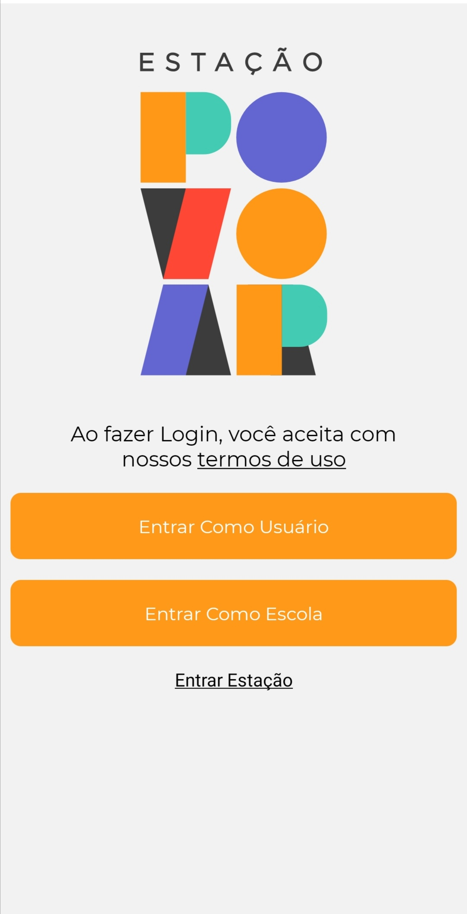
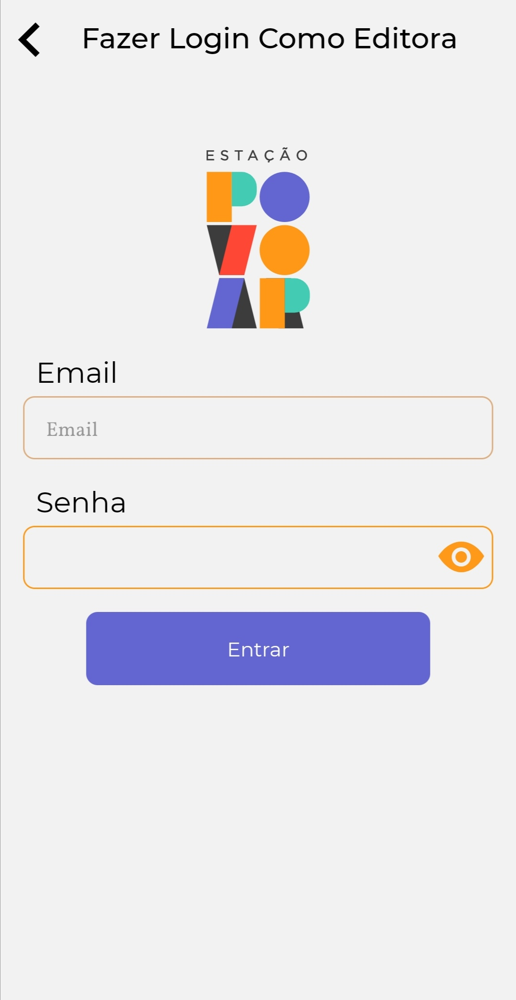
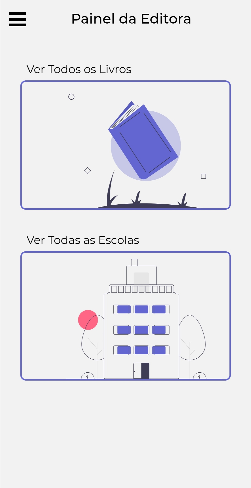
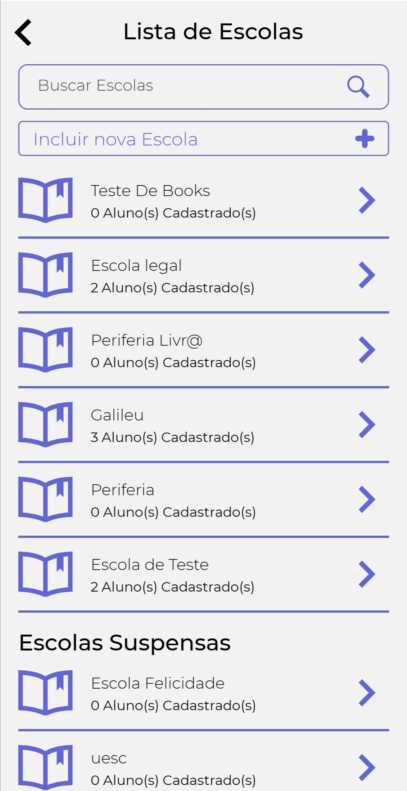
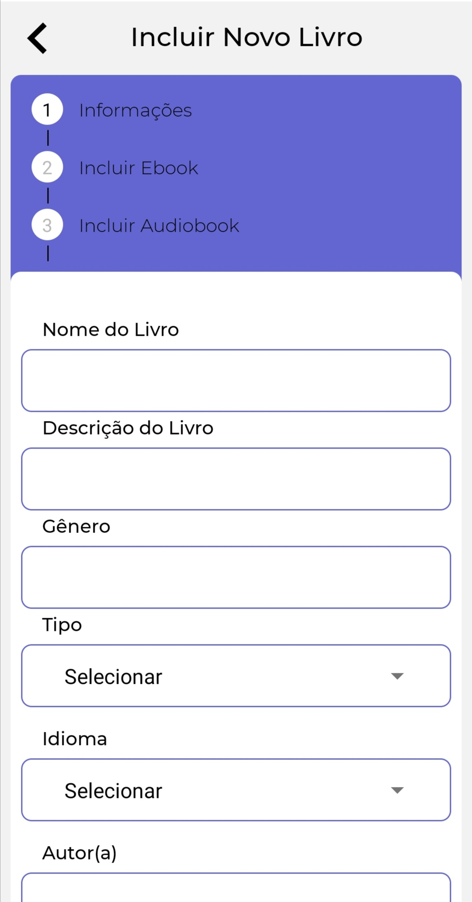

# Entrando na conta da Editora

Ao acessar o seu aplicativo da Estação Povoar, a primeira tela é a exibida abaixo. Você deve selescionar a opção ``Entrar Estação`` e então será redirecionado para fazer o login como Editora.

Após acessar o perfil da Editora é possível realizar cadastros e edições dos perfis escola e obra.

## Cadastrar uma escola

 Você deve clicar em ``Ver Todas as EScolas`` e então terá acesso a lista de escolas cadastras no aplicativo Estação Povoar. Para cadastrar uma escola, clique em ``Incluir nova Escola`` localizado no topo da tela do aplicativo. Assim, você será direcionado ao cadastro de escolas e deve inserir as informações básicas sobre a escola. tais como ``Nome da Escola``, ``Tipo do Ensino`` e endereço eletrônico, ou seja, ``Email``. Após, clique em ``Continuar`` e insira informações adicionais como ``Estado``, ``Endereço``, ``Número``e ``CEP``. Após, clique em ``Continuar``. Na tela seguinte será exibido a senha da nova escola cadastrada. Como primeiro acessso, a escola deve utilizar este código e, se quiser pode alterar depois.
 
 
 
 

### Editar perfil de escola

## Cadastrar uma obra

### Editar obra
