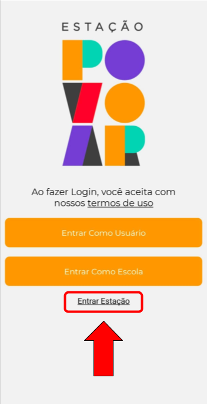

# Entrando na conta da Editora

Ao acessar o seu aplicativo da Estação Povoar, a primeira tela é a exibida abaixo. Você deve selescionar a opção ``Entrar Estação`` e então será redirecionado para fazer o login como Editora.

*Tela Inicial* 

  Atenção: Para o perfil de Editoras os dados para acesso serão fornecidos pelos desenvolvedores do aplicativo.

*Tela de login do aplicativo*

Após acessar o perfil da Editora é possível realizar cadastros e edições dos perfis escola e obra.

