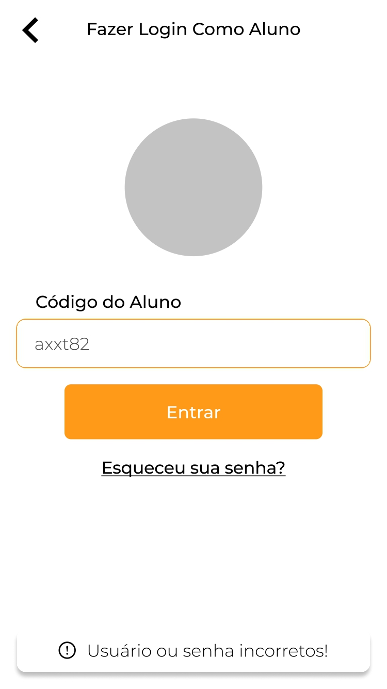

# Entrando em sua conta

Ao acessar o seu aplicativo da Estação Povoar, a primeira tela é a exibida abaixo. Vovê deve selescionar a opção ``Entrar como Usuário`` e então será redirecionado para fazer o login como Uusuário.

Para ``Fazer login como uusuário`` você dee inserir um código único, aleatório que será gerado no momento do cadastro do estudante feito pela Escola

Os códigos serão informados a cada estudante pla escola e é impossível pedr para a secretaria da escola gerar um novo, caso haja algum problema.
